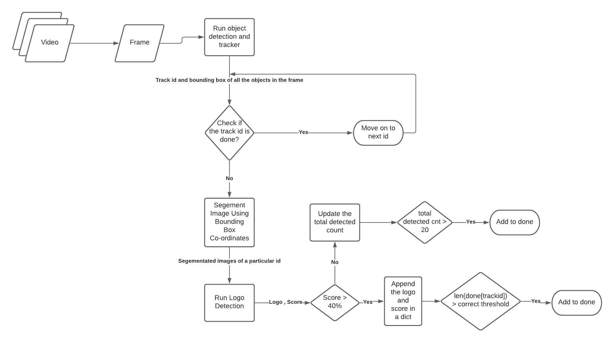

## Object and Logo Detection

### Installation and Running
- See in Colab Notebook
- 
- [Open in Jupyter](https://github.com/mananmadan/object-logo-detection/blob/master/Vision_Detection_System_(Video_%2B_DeepLogo)_Final.ipynb)

### File Structure
- Imp Files Modified in **Yolov4 + deepsort**
    - [object_tracker.py](https://github.com/mananmadan/yolov4-deepsort/blob/c336e0d3c0db085f958334d4d884f947b54972d4/object_tracker.py) : Implements yolov4 + deepsort and stores the segmented image of each object in a folder
    - [algoa.py](https://github.com/mananmadan/yolov4-deepsort/blob/c336e0d3c0db085f958334d4d884f947b54972d4/algoa.py) : Implements yolov4 + deepsort + DeepLogo for realtime detection according to the algo A as given in algo.md files
        - Outputs a Dict contains object , their ids and detected logo
    - [algob.py](https://github.com/mananmadan/yolov4-deepsort/blob/c336e0d3c0db085f958334d4d884f947b54972d4/algob.py) : Implements yolov4 + deepsort + DeepLogo for realtime detection according to the algo B given in the algo.md files
        - Ouputs a dict containing object , their ids and detected logo

- Imp Files in **Deep Logo**
    - [single_inf.py](https://github.com/mananmadan/DeepLogo/blob/9d1feeb2ec3e3a22d72cb6dbd9ca34b77243b294/single_inf.py): contains all the function that is used with the object tracker files to detect logo .. (Stands for single inference!)
    - [annotations/](https://github.com/mananmadan/DeepLogo/tree/c3d57d456d5d424c330bb16adcb3fa36f2ecc934/annotations): contains the dataset info (train,test classes distribution).Also has a parser to read through the annotation files
    - [imgs/](https://github.com/mananmadan/DeepLogo/tree/c3d57d456d5d424c330bb16adcb3fa36f2ecc934/imgs): contains the custom dataset for testing the model
    - [MODEL-PERFORMARMANCE.md](https://github.com/mananmadan/DeepLogo/blob/c3d57d456d5d424c330bb16adcb3fa36f2ecc934/MODEL-PERFORMANCE.md) : Contains the info about the testing process of the model and about the results
    - Testing Process and Notebook Demonstrating Working of Logo Detection
        - 

### Algos
- Read [algo.md](https://github.com/mananmadan/object-logo-detection/blob/master/algo.md)

#### Algo A Flowchart

#### Algo B Flowchart
